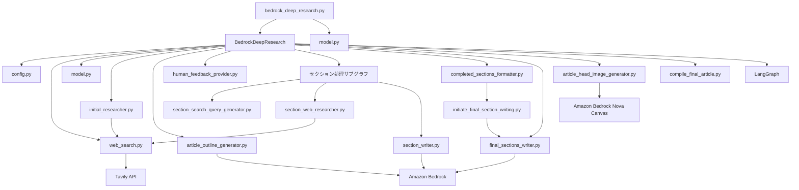
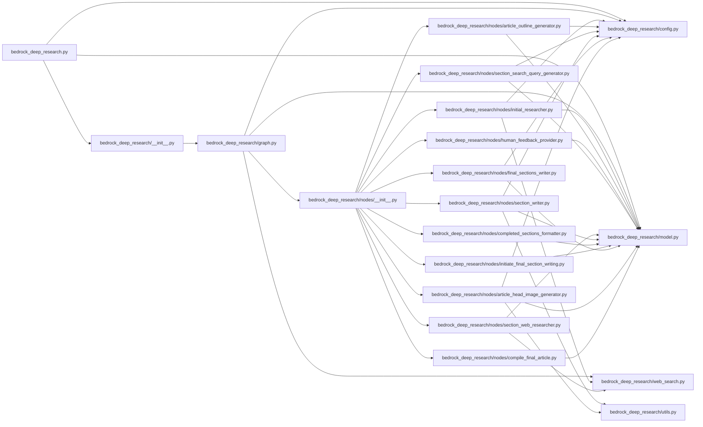
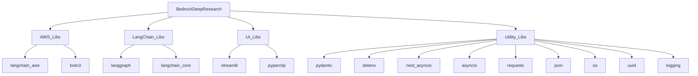
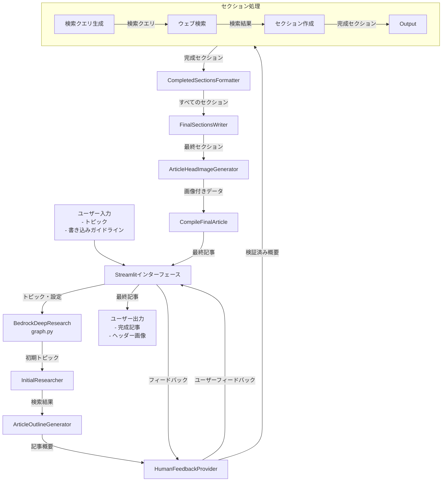

# Bedrock Deep Research - 依存関係マップ

このドキュメントでは、Bedrock Deep Researchプロジェクト内の主要なコンポーネント間の依存関係を示します。

## 主要コンポーネント間の依存関係

## ファイルレベルの依存関係

## 外部ライブラリ依存関係

## コンポーネント間のデータフロー

この依存関係マップは、各モジュールがどのように相互に関連し、データがシステム内でどのように流れるかを視覚化しています。BedrockDeepResearchクラスがワークフローの中心となり、各ノードが特定の処理を担当しています。外部サービス（Amazon Bedrock、Tavily API）への依存関係も明示されています。 