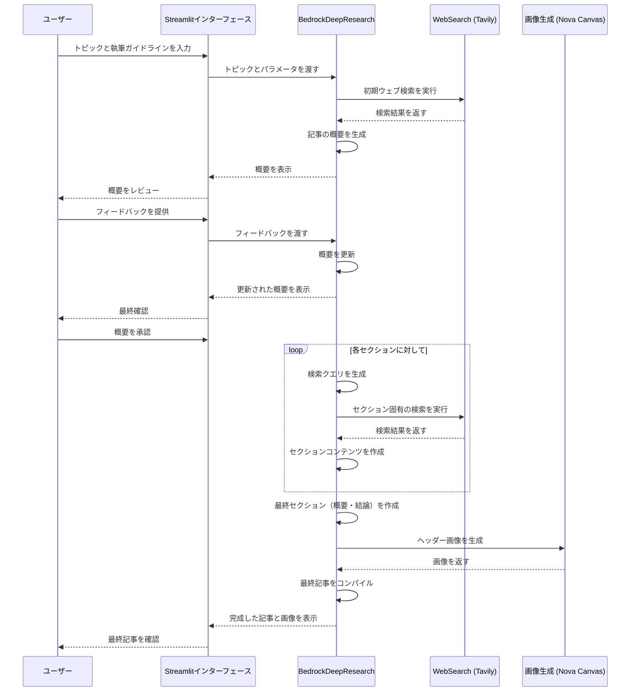
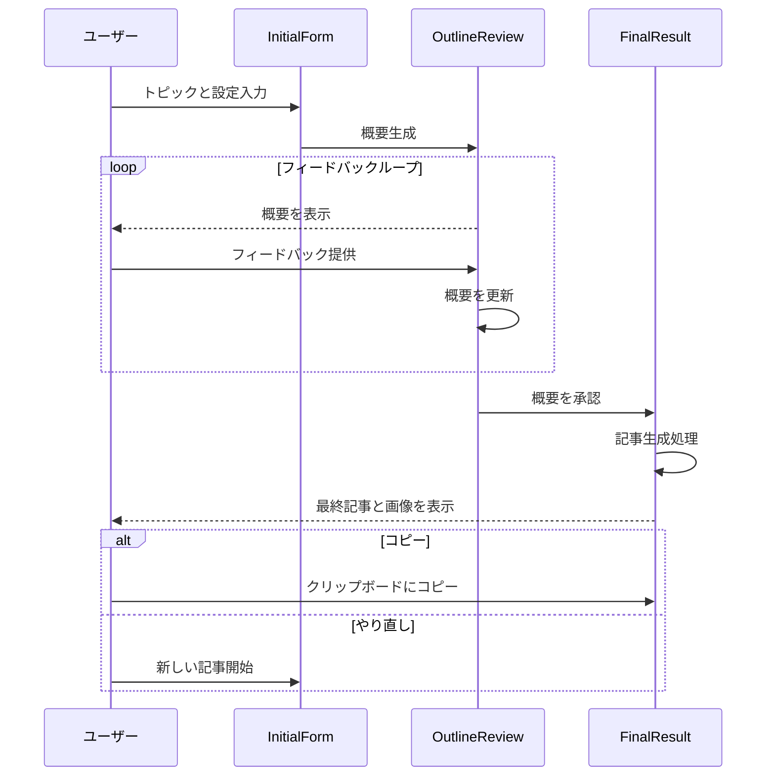

# Bedrock Deep Research - 処理シーケンス図

このドキュメントでは、Bedrock Deep Researchアプリケーションの主要な処理の流れをシーケンス図の形式で説明します。

## 全体のワークフロー



## 詳細なノード間シーケンス

```mermaid
sequenceDiagram
    participant START
    participant IR as InitialResearcher
    participant AOG as ArticleOutlineGenerator
    participant HFP as HumanFeedbackProvider
    participant SBWSR as build_section_with_web_research
    participant CSF as CompletedSectionsFormatter
    participant FSW as FinalSectionsWriter
    participant AHIG as ArticleHeadImageGenerator
    participant CFA as CompileFinalArticle
    participant END
    
    START->>IR: 開始
    IR->>AOG: 初期検索結果
    AOG->>HFP: 記事概要
    HFP->>SBWSR: 検証済み概要
    
    loop 各セクションに対して
        SBWSR->>SBWSR: セクション処理サブグラフ実行
    end
    
    SBWSR->>CSF: 完成したセクション
    
    alt すべてのセクションが完成
        CSF->>FSW: 概要と結論セクション作成
        FSW->>AHIG: 最終セクション追加
        AHIG->>CFA: ヘッダー画像を追加
        CFA->>END: 完成
    else セクションが未完成
        CSF->>SBWSR: 続行
    end
```

## セクション処理サブグラフ

```mermaid
sequenceDiagram
    participant START
    participant SSQG as SectionSearchQueryGenerator
    participant SWR as SectionWebResearcher
    participant SW as SectionWriter
    participant END
    
    START->>SSQG: セクション情報
    SSQG->>SWR: 検索クエリ
    SWR->>SW: ウェブ検索結果
    SW->>END: 完成したセクション
```

## ユーザーインタラクションフロー



この図はLangGraphを使用した処理フローを示しており、BedrockDeepResearchクラス内にある複数のノードがお互いにデータを渡しながら、記事の生成プロセスを段階的に進めていくことを表しています。ユーザーインターフェースとバックエンドのワークフロー間の相互作用も含まれています。 